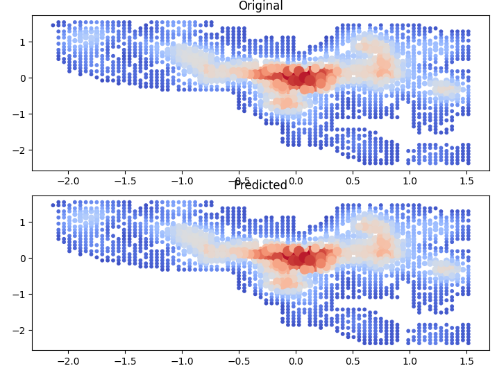

PROJEKT Z UUI
=============

Tvorba modelu
--------------
* V prvom kole sme použili sieť, ktorá mala 1 skrytú vrstvu a na nej 16 neurónov
* Chceli sme na nej zistiť najlepšiu kombináciu aktivačných funkcií
* Ako aktivačné funkcie sme skúšali hyperbolický tangens, sigmoidovú funkciu, ReLU a nakoniec lineárnu funkciu
* Testovali sme tak, že vyskúšali každú funkciu na každej vrstve a vypočítali sme si výslednú chybu ako 0.3train_error + 0.7test_error a následne sme si vybrali najlepších kandidátov.
* Trénovanie modelu prebiehalo v 50 epochách
* Náhodné hodnoty sme genrovali z rozdelenia N(0, 1/3)
* rýchlosť učenia alpha bola 0.1
* Výsledné honoty boli nasledovné:

f1, f2         | train_error | test_error | total_error
---------------|-------------|------------|------------
sigmoid, relu  |0.81829483   |0.22230778  |0.4011039
sigmoid, tanh  |0.37733077   |0.10222123  |0.18475409
sigmoid, linear|0.33415336   |0.09193737  |0.16460217
relu, sigmoid  |0.63317761   |0.1729111   |0.31099106
relu, tanh     |0.51537092   |0.15295337  |0.26167863
relu, linear   |0.551217220  |0.15441661  |0.27345679
tanh, sigmoid  |0.62685663   |0.17302799  |0.30917658
tanh, relu     |0.81829483   |0.22230778  |0.4011039
tanh, linear   |0.36629134   |0.1021441   |0.18138827
linear, sigmoid|0.9927434    |0.27207988  |0.48827894
linear, relu   |0.81829483   |0.22230778  |0.4011039
linear, tanh   |0.79554702   |0.21604676  |0.38989684

* Ale keďže výsledné hodnoty nie sú z intervalu [0, 1], na výslednej vrstve sme sa rozhodli použiť
lineárnu funkciu x + 1 (+1 preto, lebo výsledné hodnoty viac zasahujú do kladných hodnôt ako záporných)
* Následne sme odskúšali modely, ktoré mali na výslednej vrstve lineárnu aktivačnú funkciu a otestovalie sme
zvyšné 3 aktivačné funkcie na skrytej vrstve, aby sme zistili, ktorá bude najvhodnejšou
* Počet učiacich sa epoch sme natavili teraz na 100 a alphu sme nechali rovnakú
* Výsledné errory, ktoré sme dostali sú:

fcia   | train_error | test_error | total_error
-------|-------------|------------|------------
sigmoid|0.45788102   |0.12326298  |0.22364839
tanh   |0.43101548   |0.11254077  |0.20808318
relu   |0.61450503   |0.16092987  |0.29700242

* Preto sme sa rozhodli na skrytých vrstvách používať hyperbolický tangens

Zisťovanie počtu skrytých neurónov
---------------
* Keď už sme mali vybrané aktivačné funkcie, v ďalšom kroku sme chceli zistiť, aký počet neurónov je optimálny
* Na testovanie sme opäť použili dvojvrstvovú sieť s rýchlosťou učenia 0.1 a počet epoch bol 100
* Aktivačná funkcia na skrytej vrstve bola tanh a na vonkajšej bola lineárna
* Skúšali sme počty neurónov 8, 10, 12 ... 50
* Výsledné errory sú zhrnuté v nasledovnej tabuľke:

počet neurónov | total error
---------------|------------
8              |0.34141076
10             |0.49546223
12             |0.43364913
14             |0.30725816
16             |0.42649649
18             |0.3175108
20             |0.43872581
22             |0.35504076
24             |0.3953254
26             |0.58908309
28             |0.29286061
30             |0.3819434
32             |0.35375606
34             |0.47723399
36             |0.36689453
38             |0.28084964
40             |0.27341348
42             |0.31580463
44             |0.30428932
46             |0.36510255
48             |0.37062686
50             |0.34816912

* Z tohto dôvodu sme sa rozhodli používať 40 neurónov na skrytých vrstvách

Zisťovanie počtu skrytých verstiev
----------------------
* V tomto kroku sme rozhodli otestovať, aký počet vrstiev je optimálny
* Počas testovania sme zistili, že learning rate 0.1 je príliš veľký a vždy nám to preskočilo minimum pre error a pretiekli hodnoty, preto sme nastavili learning na 0.0005, s ktorým to už fungovalo bez problémov
* Počet trénovacích epoch bol 400
* Pozmenili sme generovanie náhodných váh z Gaussovho rozdelenia na rovnomerné z intervalu [-1, 1], lebo nám generovalo niekedy hodnoty väčšie ako 1
* Testovali sme počet vrstiev od 1 po 5 a testovali sme ich v 5-tich kolách
* Výsledné errory uvádzame v nasledovnej tabuľke

kolo | 1 vrstva  | 2 vrstvy  | 3 vrstvy  | 4 vrstvy  | 5 vrstiev
-----|-----------|-----------|-----------|-----------|----------
1    | 0.21465358| 0.05907851| 0.02545456| 0.01869486| 0.01975219
2    | 0.21941243| 0.06750666| 0.0295333 | 0.02062135| 0.02980421
3    | 0.21383517| 0.06896895| 0.03563489| 0.02252443| 0.01978567
4    | 0.1917839 | 0.07220759| 0.02835257| 0.01713145| 0.01730435
5    | 0.19986914| 0.05650462| 0.03012584| 0.01785095| 0.0201516
avg  | 0.20791084| 0.06485327| 0.02982023| 0.01936461| 0.02135961

* Keďže v priemere mali najmenšiu chybu 4 vrstvy, rohodli sme sa, že použijeme tento počet

Zisťovanie vhodného learning rate
-----------------
* Najprv sme sa rozhodli otestovať learning rate od 0.0001 po 0.1 s krokom 0.005, ale pri veľa hodnotách to pretieklo, preto sme sa rozhodli otestovať od 0.0001 po 0.01 s krokom 0.0001
* Výsledné errory pre sieť so 4 vrstvami po 40 nerónov a 300 epochami sme zakreslili do grafu: 

* Z toho dôvodu sme sa rozhodli použiť learning rate 0.0081

Záverečné ladenie modelu
------------------------
* V poslednom kroku sme chceli zistiť, koľko epoch nám stačí na trénovanie
* Z tréningu sme si teda uložili dáta o celkovej chybe a do grafu sme si zakreslili priemernú chybu pre daný počet epoch

* Z toho dôvodu sme sa rozhodli nastaviť počet epoch na učenie sa na 450, keďže to už medzi 400 a 500 výrazne neklesalo

Pre cvičiach
-------------
* Je pre Vás pripravený skript `main.py`, kde Vám stačí len zadať názov testovacieho súboru a program vypočíta chybu v danom pomere zo zadania
* Pre druhé kolo stačí nastaviť konštantu `LOAD_PRETRAINED` na True, program si načíta predtrénovanú sieť a vypíše znovu chybu v danom pomere.
* Po spustení evaluate po natrénovaní na všetkých dátach bola u mňa chyba cca 0.01
* V súbore `pretrained.npy` sú uložené predtrénované matice, po otestovaní tohto modelu s rozdelenými dátami na trénovacie a testovacie mal priemernú chybu vypočítanú v danom pomere 0.013
* Trénovanie u mňa trvalo pod 2 minúty
* Po predikcii z dát vyzeralo porovnanie takto:

>>>>>>> 19dfdee (added files)
